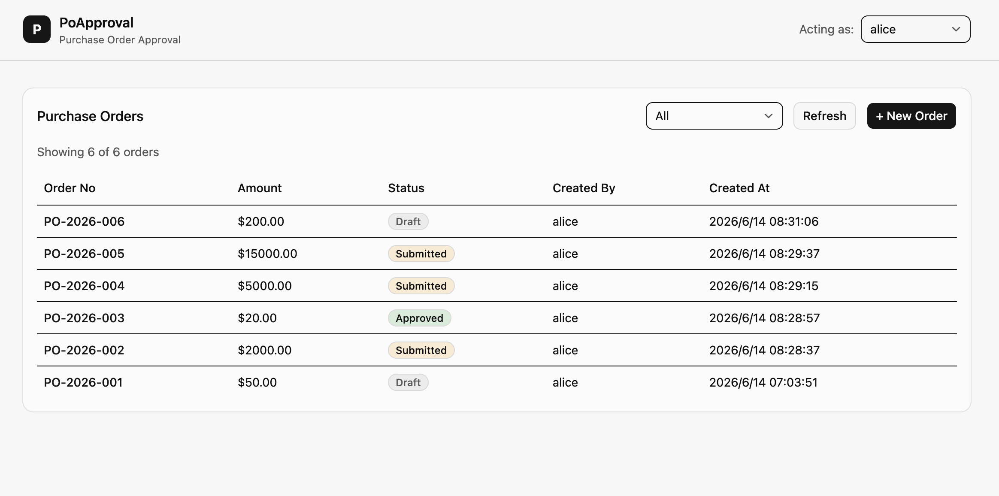
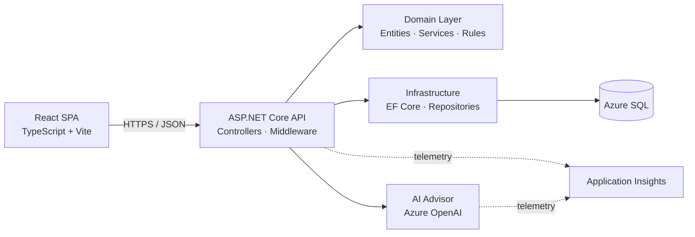
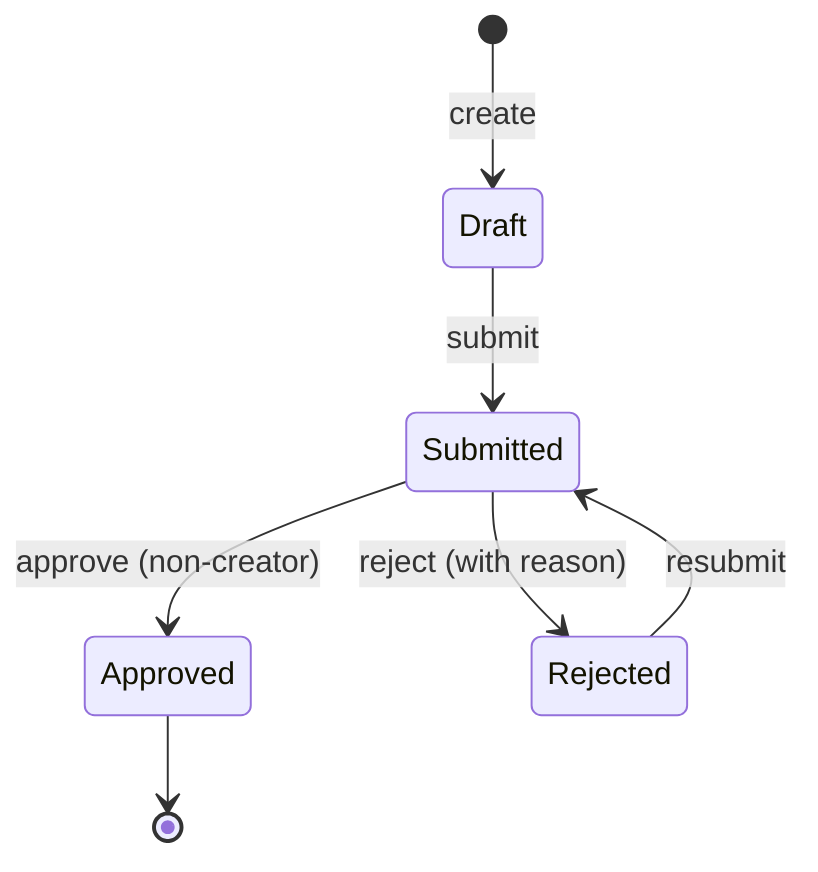
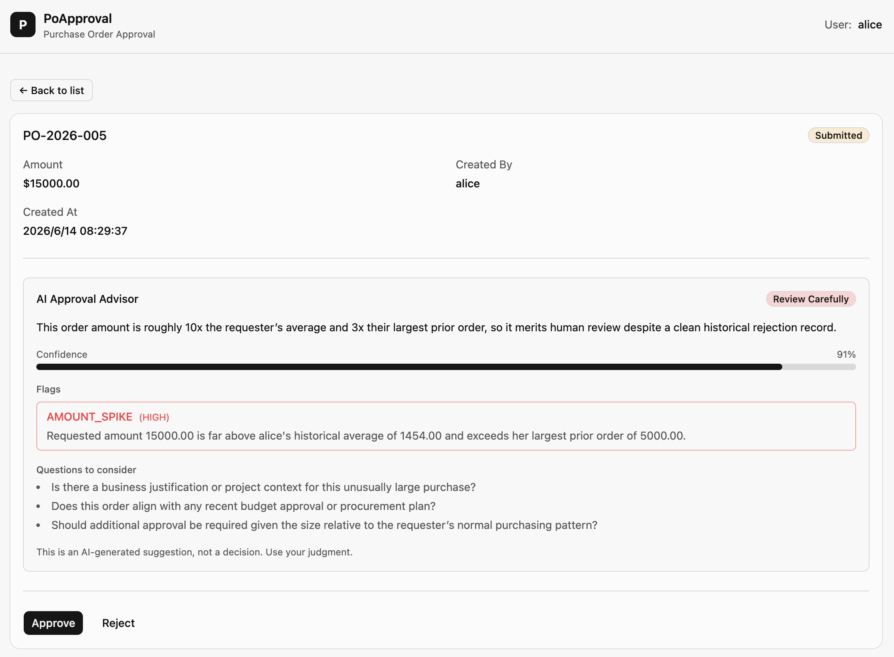

# PoApproval

A purchase order approval system — REST API and web frontend for submitting, approving, and tracking purchase orders with a state-machine driven workflow, plus an AI advisor that surfaces risk signals for human reviewers.

**🔗 Live demo: https://orange-ground-0d30a6800.7.azurestaticapps.net**

**📦 Source: https://github.com/WZJoyce/PoApproval**



---

## Tech Stack

- **Backend**: ASP.NET Core 9, EF Core 9, SQL Server
- **Frontend**: React 18, TypeScript, Vite, Tailwind v4, shadcn/ui, TanStack Query, react-hook-form + zod
- **AI**: Azure OpenAI (Azure AI Foundry)
- **Testing**: xUnit, FluentAssertions, Moq, WebApplicationFactory, Vitest + Testing Library
- **Cloud**: Azure Static Web Apps, App Service, Azure SQL Database serverless, Key Vault (Managed Identity), Application Insights
- **CI/CD**: GitHub Actions with OIDC federated credentials

---

## Architecture



The Domain layer has no dependencies on Infrastructure or external libraries, keeping business rules independently testable. API endpoints are versioned via URL segment (`/api/v1/...`) and documented through OpenAPI with Scalar UI.

---

## Order Lifecycle



Transitions are guarded by domain rules — e.g. an order cannot be approved by its creator (separation of duties), and rejection requires a reason. Invalid transitions fail fast with a clear error rather than corrupting state.

---

## AI Approval Advisor

Each submitted order can be analyzed by an AI advisor (Azure OpenAI) that reviews the requester's historical ordering patterns and surfaces risk signals for the human reviewer.

- **Advisory-only by design** — the AI produces a recommendation, risk flags, and questions for the reviewer; it never auto-approves. Human-in-the-loop is enforced.
- **Graceful degradation** — if the AI service is unavailable, the approval workflow continues unaffected; the advisor is never on the critical path.
- **Provider abstraction** — the advisor sits behind an `IApprovalAdvisor` interface, so the LLM provider can be swapped without touching business logic.
- **Prompt-injection defense** — order data is treated as untrusted input within the system prompt.
- **Cost-aware UX** — the recommendation is fetched on demand (not on every page load), since LLM calls carry latency and cost.
- **Observability** — advisor calls emit structured telemetry (verdict, confidence, latency) queryable in Application Insights.



---

## Deployment

Deployed to Azure with secrets centralized in Key Vault. CI/CD uses OIDC federated credentials, and the runtime uses Managed Identity.

- **Frontend** — Azure Static Web Apps (global CDN, auto-deploy from GitHub)
- **Backend** — Azure App Service (Linux, .NET 9)
- **Database** — Azure SQL Database serverless (auto-pause for cost efficiency on intermittent demo traffic)
- **Secrets** — Azure Key Vault; the App Service uses a system-assigned **Managed Identity** to access runtime secrets stored in Key Vault. No secrets are stored in source control or GitHub Actions.
- **CI/CD** — GitHub Actions deploys on push to `main`, authenticating to Azure via **OIDC federated credentials** (no stored credentials), with the full test suite as a deployment gate
- **Observability** — Application Insights with custom telemetry on AI advisor usage (verdict distribution, latency, failure rate)

> **Identity over secrets** — both CI/CD (OIDC) and runtime (Managed Identity) authenticate via federated identity rather than stored keys, eliminating credential rotation and leak risk.

---

## Key Decisions

- **Clean architecture** — Domain has zero outward dependencies; Infrastructure and Api depend on Domain, never the reverse.
- **Options pattern with validation** — Configuration is bound to strongly-typed POCOs with `DataAnnotations` and `ValidateOnStart`, surfacing misconfiguration at startup rather than runtime.
- **URL-segment API versioning** — Caching-friendly, easy to inspect in logs, and keeps multiple versions live during client migration.
- **ProblemDetails (RFC 7807)** — Consistent error response format across all endpoints; the frontend distinguishes 409 (conflict) from 422 (validation) to drive different UX.
- **Optimistic concurrency** — Purchase orders carry a `RowVersion` column; concurrent approvals fail fast with HTTP 409 Conflict rather than silently overwriting.

---

## Project Structure

```
src/
├── PoApproval.Api/             Web API — controllers, middleware, contracts
├── PoApproval.Domain/          Business logic — entities, services, rules
└── PoApproval.Infrastructure/  EF Core, persistence, AI advisor implementation
tests/
├── PoApproval.Domain.Tests/    Unit tests
└── PoApproval.Api.Tests/       Integration tests via WebApplicationFactory

client/                         React SPA (feature-based structure)
├── src/features/orders/        Orders feature — pages, components, hooks, API
├── src/features/auth/          Acting-user context
└── src/shared/                 Shared components and utilities
```

---

## Running Locally

Requires .NET 9 SDK and SQL Server (LocalDB on Windows or Docker on macOS/Linux).

**Backend:**

```bash
dotnet restore
dotnet build
dotnet test
cd src/PoApproval.Api
dotnet run
```

API documentation is available at `/scalar/v1` in Development.

**Frontend:**

```bash
cd client
npm install
npm run dev
```

The frontend reads the API base URL from `VITE_API_URL` (see `.env.development`).

---

## Endpoints

| Method | Path | Description |
|---|---|---|
| `GET` | `/api/v1/orders` | List purchase orders, optionally filtered by status |
| `GET` | `/api/v1/orders/{id}` | Retrieve a single purchase order |
| `POST` | `/api/v1/orders` | Create a draft purchase order |
| `POST` | `/api/v1/orders/{id}/submit` | Submit a draft for approval |
| `POST` | `/api/v1/orders/{id}/approve` | Approve a submitted order |
| `POST` | `/api/v1/orders/{id}/reject` | Reject a submitted order |
| `GET` | `/api/v1/orders/{id}/ai-recommendation` | AI advisor analysis of a submitted order |
| `GET` | `/health/live` | Liveness probe |
| `GET` | `/health/ready` | Readiness probe |

---

## CI/CD

Every push and pull request to `main` runs build, format check, and tests via GitHub Actions. Pushes to `main` additionally deploy the backend to Azure App Service — authenticated via OIDC federated credentials, gated on a passing test suite. The frontend auto-deploys to Azure Static Web Apps on the same trigger.