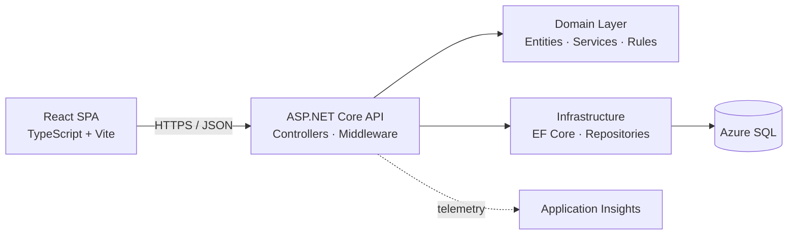

# PoApproval

A purchase order approval system — REST API and web frontend for submitting, approving, and tracking purchase orders with a state-machine driven workflow.

## Tech Stack

- **Backend**: ASP.NET Core 9, EF Core 9, SQL Server
- **Frontend**: React 18, TypeScript, Vite
- **Testing**: xUnit, FluentAssertions, Moq, WebApplicationFactory
- **Cloud**: Azure App Service, Azure SQL, Application Insights
- **CI/CD**: GitHub Actions

## Architecture



The Domain layer has no dependencies on Infrastructure or external libraries, keeping business rules independently testable. API endpoints are versioned via URL segment (`/api/v1/...`) and documented through OpenAPI with Scalar UI.

## Project Structure

```
src/
├── PoApproval.Api/             Web API — controllers, middleware, contracts
├── PoApproval.Domain/          Business logic — entities, services, configuration
└── PoApproval.Infrastructure/  EF Core, persistence

tests/
├── PoApproval.Domain.Tests/    Unit tests
└── PoApproval.Api.Tests/       Integration tests via WebApplicationFactory
```

## Key Decisions

- **Clean architecture** — Domain has zero outward dependencies; Infrastructure and Api depend on Domain, never the reverse.
- **Options pattern with validation** — Configuration is bound to strongly-typed POCOs with `DataAnnotations` and `ValidateOnStart`, surfacing misconfiguration at startup rather than runtime.
- **URL-segment API versioning** — Caching-friendly, easy to inspect in logs, and keeps multiple versions live during client migration.
- **ProblemDetails (RFC 7807)** — Consistent error response format across all endpoints.
- **Optimistic concurrency** — Purchase orders carry a `RowVersion` column; concurrent approvals fail fast with HTTP 409 Conflict rather than silently overwriting.

## Running Locally

Requires .NET 9 SDK and SQL Server (LocalDB on Windows or Docker on macOS/Linux).

```bash
dotnet restore
dotnet build
dotnet test

cd src/PoApproval.Api
dotnet run
```

documentation is available at `/scalar/v1` in Development.

## Endpoints

| Method | Path | Description |
|---|---|---|
| `GET` | `/api/v1/orders` | List purchase orders, optionally filtered by status |
| `GET` | `/api/v1/orders/{id}` | Retrieve a single purchase order |
| `POST` | `/api/v1/orders` | Create a draft purchase order |
| `POST` | `/api/v1/orders/{id}/submit` | Submit a draft for approval |
| `POST` | `/api/v1/orders/{id}/approve` | Approve a submitted order |
| `POST` | `/api/v1/orders/{id}/reject` | Reject a submitted order |
| `GET` | `/health/live` | Liveness probe |
| `GET` | `/health/ready` | Readiness probe |

## CI

Every push and pull request to `main` runs build, format check, and tests via GitHub Actions.